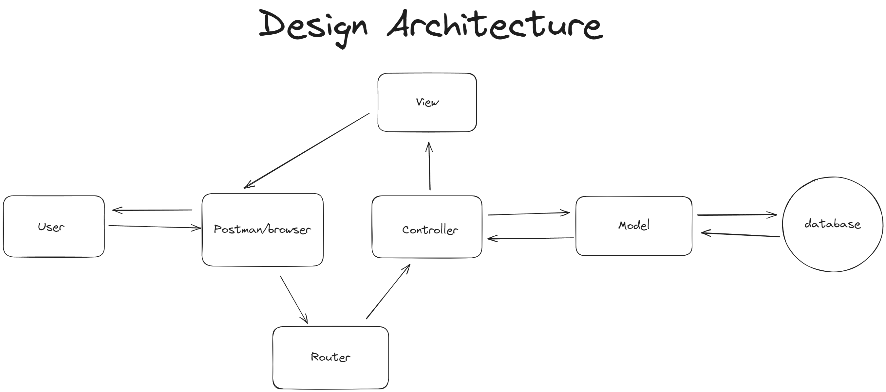

# express-mvc-orm
A simple REST API with MVP architecture and Sequelize ORM. Tools and technology used are Node.js, Express.js, Sequelize, and MySQL.

## Design Architecture


## Technologies Used
- Node.js
- Express.js
- Sequelize 
- MySQL

## How To Run:
- Local Host: Run with Postman, local IP and Port:5000 `http://127.0.0.1:3000/api/v1/books` or `http://localhost:3000/api/v1/books`
- Online Domain: not deployed yet

## Installation:
1. Install project dependencies:
```
npm install
```
2. Start the server:
- For production mode:
```
npm run start
``` 
- For development mode (with nodemon for auto-reloading):
```
npm run start-dev
```
3. Configure your database settings by editing the `config.json`. You can set the `username`, `password`, `database`, and `dialect`. Then save your changes. Example:
```
{
  "development": {
    "username": "your-username",
    "password": "your-password",
    "database": "bookDB_dev",
    "host": "127.0.0.1",
    "dialect": "mysql"
  }
}
```
5. Apply database schema migration:
```
npx sequelize-cli db:migrate
```
6. Create initial data:
```
npx sequelize-cli db:seed:all
```
7. Run the server again to apply the new database configurations.

## API Endpoints:
In this project, I use the following API URL pattern. To access all books, use: `http://localhost:3000/api/v1/books`. For other operations, the URL pattern remains consistent.

### [GET] Find all books

Request:
```
  [GET] /api/v1/books
```

Response:
```
{
    "code": 200,
    "status": "success",
    "error": false,
    "message": "Books retrieved successfully",
    "data": [
        {
            "id": 1,
            "title": "Node JS",
            "description": "Learning Node JS for beginner to advanced",
            "createdAt": "2023-10-13T20:43:57.000Z",
            "updatedAt": "2023-10-13T20:43:57.000Z"
        },
        ...
    ]
}
```

### [GET] Get book by id

Request:
```
  [GET] /api/v1/books:id
```

Response:
```
{
    "code": 200,
    "status": "success",
    "error": false,
    "message": "Book retrieved successfully",
    "data": {
        "id": 5,
        "title": "Learn MySQL",
        "description": "Learning MySQL for beginner to advanced",
        "createdAt": "2023-10-14T21:47:34.000Z",
        "updatedAt": "2023-10-14T21:47:46.000Z"
    }
}
```

### [POST] Create new book

Request:
```
  [POST] /api/v1/books
```

Request Body:
```
  {
    "title": (string),
    "description": (string)
  }
```

Response:
```
{
    "code": 201,
    "status": "success",
    "error": false,
    "message": "Book created successfully",
    "data": {
        "id": 6,
        "title": "Learn Sequelize",
        "description": "Learning Sequelize for beginner to advanced",
        "createdAt": "2023-10-14T22:13:45.026Z",
        "updatedAt": "2023-10-14T22:13:45.026Z"
    }
}
```

### [PATCH] Update book by id

Request:
```
  [PATCH] /api/v1/books:id
```

Request Body:
```
  {
    "title": (string),
    "description": (string)
  }
```

Response:
```
{
    "code": 200,
    "status": "success",
    "error": false,
    "message": "Book updated successfully",
    "data": {
        "id": "6",
        "title": "Learn MVC",
        "description": "Learning MVC for beginner to advanced",
        "createdAt": "2023-10-14T22:13:45.000Z",
        "updatedAt": "2023-10-14T22:14:05.781Z"
    }
}
```

### [DELETE] Delete book by id

Request:
```
  [PATCH] /api/v1/books:id
```

Response:
```
{
    "code": 200,
    "status": "success",
    "error": false,
    "message": "Book deleted successfully",
    "data": {
        "id": "6",
        "title": "Learn MVC",
        "description": "Learning MVC for beginner to advanced",
        "createdAt": "2023-10-14T22:13:45.000Z",
        "updatedAt": "2023-10-14T22:14:05.000Z"
    }
}
```

[**@2023 Zeen**](https://www.linkedin.com/in/muhammad-razin-syakib/)
